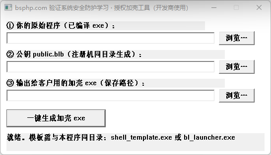
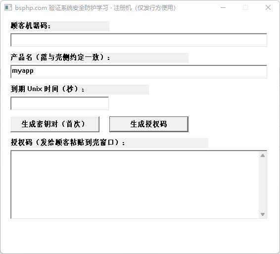

# 注册机 / 註冊機 / License Keygen

---

## 简体中文

本仓库**附带完整 C++ 源码**，适合初学者学习授权与壳相关流程；**已编译好的注册机**在 **`编译好注册机`** 目录中，可直接使用，无需先编译。

| 工具 | 说明 |
|------|------|
| **`bl_keygen.exe`** | **签名工具**：生成 RSA 密钥对（`private.blb` / `public.blb`），并根据顾客机器码等信息签发 Base64 授权码。**仅发行方自用**，勿发给客户。 |
| **`bl_packer.exe`** | **加固工具**：将目标程序与公钥等打包为加壳后的单个 exe；加壳时需选用与注册机密钥对匹配的 **`public.blb`**。 |

### 图示

### 简单使用过程

1. 将 **`bl_keygen.exe`** 放在仅自己可访问的文件夹，首次运行后点击 **「生成密钥对（首次）」**，得到 **`private.blb`**（保密）与 **`public.blb`**。
2. 使用 **`bl_packer.exe`**：选择待保护的 **`*.exe`**、对应的 **`public.blb`**、输出路径，生成发给顾客的加壳程序。
3. 顾客运行加壳程序，将窗口中的 **机器码** 发给你；你在注册机中填入机器码、产品名、到期时间等，点击 **「生成授权码」**，将授权码发回顾客完成激活。

更详细的步骤、注意事项与常见问题见：**[`编译好注册机/注册机使用说明.md`](编译好注册机/注册机使用说明.md)**；源码与编译说明见：**[`cpp/README.md`](cpp/README.md)**。

---

## 繁體中文

本儲存庫**附完整 C++ 原始碼**，適合初學者學習授權與殼相關流程；**已編譯好的註冊機**位於 **`编译好注册机`** 資料夾，可直接使用，無須先自行編譯。

| 工具 | 說明 |
|------|------|
| **`bl_keygen.exe`** | **簽名工具**：產生 RSA 金鑰對（`private.blb` / `public.blb`），並依顧客機器碼等資料簽發 Base64 授權碼。**僅供發行方自用**，請勿提供予客戶。 |
| **`bl_packer.exe`** | **加固工具**：將目標程式與公鑰等封裝為加殼後的單一 exe；加殼時須選用與註冊機金鑰對相符之 **`public.blb`**。 |

### 圖示

### 簡要使用流程

1. 將 **`bl_keygen.exe`** 置於僅本人可存取之資料夾，首次執行後點選 **「生成密钥对（首次）」**，取得 **`private.blb`**（務必保密）與 **`public.blb`**。
2. 使用 **`bl_packer.exe`**：選擇待保護之 **`*.exe`**、對應之 **`public.blb`**、輸出路徑，產生交予顧客之加殼程式。
3. 顧客執行加殼程式，將視窗內 **機器碼** 傳給您；您於註冊機填入機器碼、產品名、到期時間等，點選 **「生成授权码」**，將授權碼回傳顧客完成啟用。

更完整說明請見：**[`编译好注册机/注册机使用说明.md`](编译好注册机/注册机使用说明.md)**；原始碼與編譯請見：**[`cpp/README.md`](cpp/README.md)**。

---

## English

This repository **includes full C++ source code** for learning how licensing and the launcher shell work. A **pre-built keygen** is provided under **`编译好注册机`** so you can run it without compiling first.

| Tool | Role |
|------|------|
| **`bl_keygen.exe`** | **Signing tool**: generates an RSA key pair (`private.blb` / `public.blb`) and issues Base64 license tokens from the customer’s machine code and your settings. **Publisher use only** — do not ship to customers. |
| **`bl_packer.exe`** | **Packer / hardening tool**: builds a single packed exe from your target program and the public key; when packing, use the **`public.blb`** that matches the same key pair as your keygen’s `private.blb`. |

### Screenshots

### Quick workflow

1. Put **`bl_keygen.exe`** in a folder only you can access. On first run, use **「生成密钥对（首次）」** to create **`private.blb`** (keep secret) and **`public.blb`**.
2. Run **`bl_packer.exe`**: select your **`*.exe`**, the matching **`public.blb`**, and an output path to produce the packed build you give to customers.
3. The customer runs the packed app and sends you the **machine code** from the window. Enter it in the keygen together with product name and expiry, click **「生成授权码」**, and send the license string back so they can activate.

For full steps and troubleshooting, see **`编译好注册机/注册机使用说明.md`** (Simplified Chinese, Traditional Chinese, English). Build instructions: **`cpp/README.md`**.
